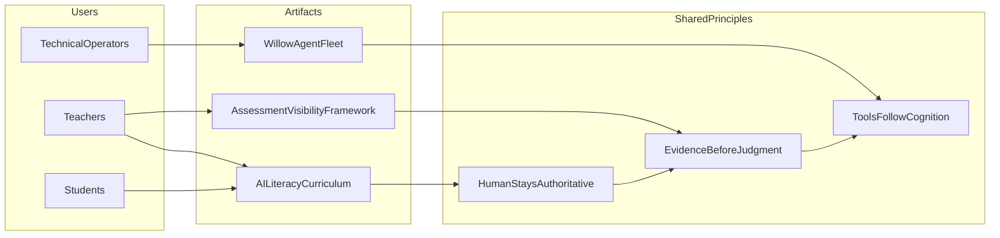

# Portfolio Case Studies

**Sean Campbell** · Technical employer packet · 2026

Three projects that show the same through-line: build real systems for real users under real constraints, keep humans authoritative over AI outputs, and make evidence visible before automating judgment.

---

## Case Study 1 — AI Literacy Curriculum for High School

**One-line summary:** A six-lesson AI literacy arc for grades 9–12 that demystifies LLMs, surfaces bias and consent, and ends with student agency — built so any teacher can run it without devices or prep beyond reading the lesson file.

**Status:** Public contributor materials (example submission for Emerging Rule community review)

**Evidence:** [lessons/ai-literacy-9-12-index.md](../lessons/ai-literacy-9-12-index.md) · [Lesson 01 — The Oracle That Guesses](../lessons/ai-literacy-hs-01-the-oracle-that-guesses.md)

---

### Problem

High school students are already using AI to write, get recommendations, and be evaluated by algorithmic systems — often with contradictory intuitions about what the tools are. Most classroom materials either require devices, assume coding literacy, or treat AI as a policy problem instead of a mechanics-and-ethics problem teachers can teach in one period.

### Audience / users

- **Primary:** High school teachers (any subject) with ~50 minutes and heterogeneous classrooms
- **Secondary:** Students grades 9–12; curriculum reviewers and open-education contributors

### Constraints

- **Posole criterion:** usable with 30 students, no devices required for core activities, no prep beyond reading the lesson file
- Lessons must stand alone *or* build as a series — a teacher with one period can pick any unit
- Philosophy, writing, debate, and discussion as primary modes — no coding required
- Optional device extensions offered but never assumed

### What I built / designed

- **Series architecture:** Six-lesson arc moving mechanics → ethics → agency ([index](../lessons/ai-literacy-9-12-index.md))
- **Lesson design pattern:** Each file includes learning objectives, `## For Teachers` facilitation notes, timing guides, discussion scaffolds, optional extensions, and CC BY 4.0 license block
- **Representative units:**
  - *The Oracle That Guesses* — replaces "search engine" and "mind" misconceptions with the durable model: prediction, not comprehension
  - *Whose Voice Is This?* — training data, representation, close-reading of AI-generated community descriptions
  - *The Consent Ledger* — data lifecycle and informed-consent asymmetry via role-play case study
  - *After the Tool* — capstone manifesto; grades engagement, not ideological content
- **Cross-repo integration:** Lessons reference story-first K–12 materials (e.g. [The Scribe Who Forgot His Dreams](../lessons/cs-k12-the-scribe-who-forgot-his-dreams.md)) for continuity across age bands

### Technical judgment

- **Mechanistic accuracy over hype:** Lesson 01 holds students in productive uncertainty — anthropomorphization is named as a phenomenon, not dismissed as ignorance
- **Device-optional by design:** Core pedagogy does not depend on live API access, reducing equity gaps and classroom failure modes
- **Modular release:** Standalone lessons reduce adoption friction; series philosophy still rewards full arc for departments building a program
- **Human authority preserved:** AI assists drafting in some repo materials; source selection, editorial standards, and final wording remain human-directed

### Evidence

| Artifact | Link |
|----------|------|
| Series index & philosophy | [lessons/ai-literacy-9-12-index.md](../lessons/ai-literacy-9-12-index.md) |
| Lesson 01 (full teacher packet) | [lessons/ai-literacy-hs-01-the-oracle-that-guesses.md](../lessons/ai-literacy-hs-01-the-oracle-that-guesses.md) |
| Related K–12 calibration series | [lessons/ai-calibration-6-10-index.md](../lessons/ai-calibration-6-10-index.md) |
| Community context | [Emerging-Rule/community](https://github.com/Emerging-Rule/community) |

### Transferable strengths

- **Curriculum / product design** for non-technical end users under tight time constraints
- **Risk communication** — translating LLM behavior into durable mental models
- **Information architecture** — consistent lesson schema across a multi-unit release
- **Inclusive design** — no-device core, optional extensions, standalone modularity
- **Technical writing** — facilitator guides that reduce support burden on adoption

---

## Case Study 2 — Assessment Visibility Framework

**One-line summary:** A research-grounded white paper and teacher implementation companion arguing that AI-present schools need *more* assessment visibility through multiple expressive pathways — not performance-only outputs or surveillance — with practical tools principals and PLCs can use immediately.

**Status:** Published framework (v1.1, May 2026) with companion appendices and classroom tools

**Evidence:** [education/assessment-visibility-v1.1/white-paper.md](../education/assessment-visibility-v1.1/white-paper.md) · [Appendix E — Educator Implementation Companion](../education/assessment-visibility-v1.1/appendix-e.md)

---

### Problem

Schools responding to AI often frame the issue as cheating detection or output restriction. That framing misses a deeper systems failure: conventional assessment already under-sees learning by optimizing for narrow, fast, comparable outputs. AI intensifies the blind spot — it does not create it.

### Audience / users

- **Primary:** Classroom teachers, PLCs, and department leads defending instructional integrity to principals and families
- **Secondary:** Administrators and curriculum designers evaluating governance posture in AI-present environments

### Constraints

- Must align with learner-centered pedagogy without mandating a single methodology or vendor
- Ethical access and equity treated as **structural design**, not compliance checkbox
- AI positioned as constrained secondary scaffold — **after** engagement and meaning construction
- Companion tools must be usable in a 10–15 minute team huddle, not a multi-day training

### What I built / designed

- **White paper (v1.1):** [Assessment Evidence and Expressive Pathways in AI-Present Schools](../education/assessment-visibility-v1.1/white-paper.md) — reframes the problem from performance acceleration to assessment visibility; formal argument with executive summary and principle set
- **Appendix suite:** Pattern evidence mapping, ethics notes, living references, illustrative case studies ([README](../education/assessment-visibility-v1.1/README.md))
- **Classroom Signals Guide:** Shared observational language for staff ([classroom-signals.md](../education/assessment-visibility-v1.1/classroom-signals.md))
- **Appendix E — Educator Implementation Companion (E1–E4):**
  - **E1** — Belief-shift tool: "narrow evidence produces false negatives"
  - **E2** — Unit design worksheet: same goal, multiple pathways
  - **E3** — Reflection filter for AI-assisted work sequencing
  - **E4** — Principal alignment one-pager
- **Structured edition:** [assessment-visibility-v1.1.json](../education/assessment-visibility-v1.1/assessment-visibility-v1.1.json) for KB / tooling ingestion
- **Version honesty:** v1.1 explicitly documents what v1.0 promised but did not ship (missing appendix text) — modeling governance transparency in the artifact itself

### Technical judgment

- **Governance over surveillance:** Transparency framed as trust and instructional integrity, not behavioral monitoring
- **Teacher judgment irreplaceable:** No tool or model positioned as evaluative authority — resists the "AI grader" shortcut
- **Equity as measurement design:** Expanding expressive pathways increases accuracy by reducing false negatives; rigor held constant
- **Tool sequencing:** AI support only after cognition — prevents the common failure mode of outsourcing sense-making to the scaffold
- **No product lock-in:** Framework is vendor-neutral; implementation tools use classroom voice, not platform branding

### Evidence

| Artifact | Link |
|----------|------|
| Main white paper | [education/assessment-visibility-v1.1/white-paper.md](../education/assessment-visibility-v1.1/white-paper.md) |
| Package README & v1.1 changelog | [education/assessment-visibility-v1.1/README.md](../education/assessment-visibility-v1.1/README.md) |
| Teacher tools (start with E4 for principals) | [education/assessment-visibility-v1.1/appendix-e.md](../education/assessment-visibility-v1.1/appendix-e.md) |
| Illustrative case studies | [education/assessment-visibility-v1.1/appendix-a.md](../education/assessment-visibility-v1.1/appendix-a.md) |

### Transferable strengths

- **Research synthesis** — policy discourse translated into defensible classroom practice
- **Governance design** — human-in-the-loop principles encoded in framework, not slogans
- **Tooling for adoption** — E1–E4 reduce time-to-value for non-technical stakeholders
- **Technical documentation** — version notes, structured JSON edition, appendix architecture
- **Stakeholder communication** — executive summary + principal one-pager + PLC prompts

---

## Case Study 3 — Systems Building: Local-First Agent Memory (Willow)

**One-line summary:** I built Willow from scratch: a local-first backend platform for agent workflows with a Postgres knowledge graph, hybrid retrieval, task queue, MCP API surface, Grove message bus, handoffs, and verification loops — designed so AI agents remember, coordinate, execute, and cite evidence without cloud dependency or opaque automation.

**Status:** Working local system and public open-source project ([willow-2.0](https://github.com/rudi193-cmd/willow-2.0)); active development with external contributors

**Evidence:** [willow-2.0](https://github.com/rudi193-cmd/willow-2.0) · [safe-app-store](https://github.com/rudi193-cmd/safe-app-store) · Author background in [ai-education-reading-list.md](../education/emerging-rule/ai-education-reading-list.md)

**Deep dive (this packet):** [willow-systems-portfolio.md](willow-systems-portfolio.md) · [willow-ecosystem-inventory.md](willow-ecosystem-inventory.md)

---

### Problem

Agentic AI workflows fail in practice when memory is session-scoped, tasks are fire-and-forget, and there is no durable graph of what was decided versus what was merely suggested. Cloud-only stacks add latency, cost, and privacy risk for operators who need local control — especially in education and research contexts where provenance matters.

There was also a personal systems-building challenge: I began this work with very little conventional software engineering background. Willow became the learning vehicle. I used AI assistance, documentation, debugging loops, and repeated rebuilds to move from concept to a working multi-component platform. The result is not just a writing project about AI systems; it is an actual system I designed, implemented, operated, and iterated.

### Audience / users

- **Primary:** Developers and technical operators running multi-agent workflows on local infrastructure
- **Secondary:** Contributors extending the SAFE app ecosystem; curriculum authors using the UTETY faculty layer to draft and stress-test materials before human publication

### Constraints

- **Local-first backend:** Postgres KB, SQLite SOIL stores, Ollama default, no mandatory cloud APIs
- **Human-directed:** Agents propose; humans ratify — knowledge ingestion gated on redundancy/contradiction checks
- **Portless / SAFE model:** Apps run without exposing ports or requiring subscription SaaS ([safe-app-store](https://github.com/rudi193-cmd/safe-app-store))
- **Public release discipline:** External-facing repos kept clean — no hard-coded paths, no sprawling internal docs in the public tree

### What I built / designed

- **Willow 2.0 core:** Local-first backend, MCP tool surface, fleet coordination — described publicly as *"Postgres KB, Ollama default, Grove LAN remote"*
- **Data plane:** Postgres-backed knowledge, tasks, edges, Jeles atoms, Opus atoms, and FRANK ledger entries; SQLite retained for fast local SOIL/session state where appropriate
- **Knowledge layer:** Hybrid search (pgvector + BM25), lifecycle tiers (frontier → contested → canonical → superseded), tamper-evident FRANK ledger for audit trail
- **Execution plane:** Kart Postgres task queue and sandboxed worker pattern for shell work — separates reasoning agents from autonomous execution
- **Coordination:** Grove Postgres message bus for agent-to-agent communication; dispatch and handoff patterns for session continuity
- **Curriculum bridge (UTETY):** Faculty persona layer used to draft and stress-test classroom materials (e.g. [Scribe lesson](../lessons/cs-k12-the-scribe-who-forgot-his-dreams.md), [reading list](../education/emerging-rule/ai-education-reading-list.md)) with explicit human author of record
- **Ecosystem:** SAFE App Store for local-first app distribution; related public repos (stash, ctxvault, holon, mengram, ogham-mcp) forming a coherent agent-memory portfolio

### Systems-building trajectory

This is the part a technical employer should evaluate directly: Willow shows that I can learn unfamiliar engineering domains by building the system that forces the learning.

- **From limited SWE background to backend platform:** I did not start with a traditional backend or infrastructure resume. I learned by decomposing the problem into persistence, schemas, retrieval, tool APIs, worker queues, message routing, policies, handoffs, and release hygiene, then making each piece work well enough to support the next.
- **AI-assisted development as a disciplined workflow:** AI accelerated implementation, but it did not replace judgment. I used agents to explore, draft, debug, and refactor while keeping human review, repo hygiene, public/private boundaries, and evidence checks explicit.
- **Architecture through pressure:** Components emerged from repeated operational failures: session memory loss became handoffs and KB atoms; unreliable shell execution became Kart; unverifiable agent claims became source-trail, ledgers, and ingest gates; cross-agent confusion became Grove and dispatch semantics.
- **Public/private separation:** The public repos show the distributable system; private operator state, credentials, and data vaults stay out of the portfolio. That boundary is part of the engineering work.
- **Learning signal:** The most important proof is not that I already knew every framework. It is that I could identify the missing capability, find or build the abstraction, test it in my own workflow, and keep improving the system under real use.

### Technical judgment

- **Search before build:** KB query required before agents implement — reduces duplicate work across sessions and agents
- **Gate on ingest:** `mem_check` / redundancy-contradiction gates before knowledge writes — prevents silent graph pollution
- **Tiered truth:** Not every atom is canonical; lifecycle tiers make epistemic status explicit
- **Separation of planes:** Postgres-backed memory, SOIL session state, Grove messaging, and Kart execution each have distinct responsibilities — cross-agent dispatch does not require daemons for work that must run unattended
- **Local default, cloud optional:** Ollama for inference; provider routing available but not required — fits operators with air-gapped or privacy-sensitive environments
- **Same principles in education repo:** Assessment framework and curriculum both insist tools follow cognition; Willow encodes that structurally in agent workflows

### Evidence

| Artifact | Link |
|----------|------|
| Willow 2.0 (public) | https://github.com/rudi193-cmd/willow-2.0 |
| SAFE App Store (public) | https://github.com/rudi193-cmd/safe-app-store |
| Deep systems case study | [willow-systems-portfolio.md](willow-systems-portfolio.md) |
| Ecosystem inventory (repos, DBs, apps) | [willow-ecosystem-inventory.md](willow-ecosystem-inventory.md) |
| Author AI-systems background | [education/emerging-rule/ai-education-reading-list.md](../education/emerging-rule/ai-education-reading-list.md) (About the author) |
| Classroom material stress-tested via UTETY | [lessons/cs-k12-the-scribe-who-forgot-his-dreams.md](../lessons/cs-k12-the-scribe-who-forgot-his-dreams.md) |
| Portfolio landing | https://rudi193-cmd.github.io |

*Note: Private fleet config and operator data vaults are intentionally not public; this case study references only public repositories and published writing.*

### Transferable strengths

- **Self-directed engineering growth** — learned backend, local infrastructure, MCP, task queues, and knowledge systems by shipping a working platform
- **Systems architecture** — memory, tasks, graph, messaging, and tool surfaces as separable planes
- **AI safety / reliability** — ingest gates, ledger audit, tiered knowledge lifecycle
- **Developer experience** — MCP tool registry, handoff format, structured diagnostics
- **Local-first / privacy-aware design** — viable without cloud inference or port exposure
- **Cross-domain integration** — same human-directed AI principles in agent infrastructure and K–12 curriculum

---

## Cross-project through-line

These three projects are not three careers — they are one design stance applied at different layers: **make learning and decisions visible, keep humans authoritative, and build tools that earn trust instead of assuming it.**

---

## What to ask me in an interview

- How the posole criterion shaped lesson structure and what I'd cut if a district had devices in every seat
- Why assessment visibility is a measurement-design problem, not an AI-detection problem
- How I built Willow from scratch with limited prior SWE background, and what that taught me about architecture (see [willow-systems-portfolio.md](willow-systems-portfolio.md))
- How the RH research harness uses the same KB ingest pipeline as the agent fleet — and what I claim vs. what stays research-in-progress
- How Willow's ingest gates and knowledge tiers map to production RAG hygiene
- Where I've been wrong — e.g. v1.0 appendix gap in Assessment Visibility and how v1.1 fixed it
- What I'd prioritize next: Spanish bilingual release for HS lessons, HNS implementation, or contributor onboarding for seed.py cross-platform installs

---

*All linked repo materials CC BY 4.0 unless noted. Last updated: 2026-06-10.*
