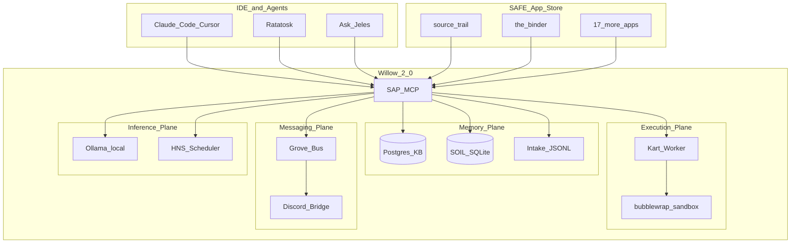

# Systems Building: Willow Local-First Agent Platform

**Sean Campbell** · Technical portfolio · 2026-06-10

This document is the deep systems case study behind the summary in [portfolio-case-studies.md](portfolio-case-studies.md). It is written for technical hiring managers and senior engineers who want evidence of architecture, integration, and learning-by-shipping — not a product pitch.

**Evidence map:** [willow-ecosystem-inventory.md](willow-ecosystem-inventory.md)

---

## Executive summary

Willow is a local-first agent memory and orchestration platform built from scratch by an operator with limited prior software-engineering background, using AI-assisted development as a force multiplier. Over roughly 18 months it grew from a SQLite prototype into a Postgres-backed backend platform with real data planes, worker queues, message routing, retrieval infrastructure, and operational guardrails:

- A **Postgres knowledge graph** (hybrid retrieval, lifecycle tiers, bi-temporal edges, tamper-evident ledger)
- An **MCP tool surface** (~90+ tools) consumed by Claude Code, Cursor, and custom agents
- A **SAFE App Store** (19 portless local-first apps)
- **Grove** (Postgres message bus + Discord bridge)
- **Kart** (Postgres task queue + sandboxed worker execution)
- **HNS** (heterogeneous node scheduling across Ollama tiers)
- **Jeles** (29 institutional source integrations for cited research)

The hiring signal is not "built a chatbot." It is: **designed and operated backend infrastructure for agentic workflows** — persistence, retrieval, queues, worker isolation, message coordination, governance, and release boundaries — then shipped a versioned release (`v2026.06.0`) with documented migration paths.

---

## Systems-building trajectory

| Phase | What happened | Evidence |
|-------|---------------|----------|
| **Prototype** | SQLite KB, single-agent MCP, manual ingest | `willow-1.9`, early `store/*.db` patterns |
| **Backend platform** | Postgres migration, schema-backed KB, SOIL collections, intake layer, fleet agents | `willow-2.0`, `sap/sap_mcp.py`, `willow.md` contract |
| **Execution + messaging** | SAFE App Store, Grove bus, Kart worker, Discord remote control | `safe-app-store`, `safe-app-willow-grove`, PR #226 |
| **Research ops** | RH corpus ingest, Fisher figure reproduction, source-trail verification | `sandbox/rh_harness/`, `rh_dirty_kb_export.jsonl` |
| **Release discipline** | Versioned ship, Windows compat, ledger repair, benchmark baselines | `v2026.06.0` release notes, LoCoMo bench |

**Learning model:** Architecture decisions came from failure modes (context loss, duplicate atoms, hook deadlocks, retrieval drift), not from textbook patterns applied upfront. AI coding tools accelerated implementation; human judgment retained ownership of boundaries, security, and claim accuracy.

---

## Architecture overview

---

## Proof point 1: Knowledge graph and retrieval

**Problem:** Agent sessions lose context; naive RAG duplicates and contradicts.

**Design:**
- Postgres `knowledge` table with bi-temporal edges and lifecycle tiers (`frontier` → `contested` → `canonical` → `superseded`)
- Hybrid search: pgvector embeddings + BM25 with reciprocal rank fusion
- `mem_check` gate before `kb_ingest` — blocks redundant/contradictory atoms unless forced
- FRANK tamper-evident ledger for audit trail
- Unified intake JSONL layer routes to Jeles, KB, Opus, or Binder queue

**Portfolio claim:** Designed a memory system with explicit quality gates and auditability, not a flat vector dump.

**Public evidence:** [willow-2.0 README](https://github.com/rudi193-cmd/willow-2.0), `kb_search` / `kb_ingest` MCP tools, `v2026.06.0` release (source-trail, ledger repair).

---

## Proof point 1A: Backend data plane

**Problem:** A multi-agent system cannot rely on prompt history, one-off JSON files, or an unversioned vector store as its source of truth.

**Design:**
- Migrated the core memory layer from SQLite-era prototypes into Postgres-backed tables for knowledge, tasks, edges, Jeles atoms, Opus atoms, agents, and FRANK ledger entries
- Kept SQLite where it made sense: SOIL per-agent state, handoffs, local app stores, benchmark atoms, and fast session snapshots
- Built explicit write paths instead of hidden side effects: intake JSONL → routing/promote pass → KB/Jeles/Opus/Binder lanes
- Exposed backend operations through MCP tools (`kb_search`, `kb_ingest`, `pg_edge_add`, `task_submit`, `ledger_verify`) so IDE agents use the same contracts as scripts and apps
- Added operational checks: `fleet_status`, `diagnostic_summary`, ledger verification, stale task detection, and dry-run consolidation passes

**Portfolio claim:** This is backend systems work: schema-backed state, queues, retrieval indexes, audit logs, tool APIs, and operational diagnostics. Willow is not just an agent prompt wrapper.

---

## Proof point 2: MCP tool surface and contract

**Problem:** 100+ capabilities need discoverability, gating, and IDE integration without port sprawl.

**Design:**
- `sap/sap_mcp.py` — single MCP server, profile-based tool exposure (`minimal` | `core` | `standard` | `full`)
- `sap/mcp_registry.json` — tool registry with domain grouping
- `willow.md` + `docs/CONTRACT.md` — boot ceremony, namespace rules, kb_search-before-build
- SAFE gate: manifest trust levels, GPG signing for fleet agents

**Portfolio claim:** Built a production-shaped tool API with governance, not a script collection.

**Public evidence:** MCP integration in Claude Code / Cursor; `fleet_tool_guide` for discovery.

---

## Proof point 3: SAFE App Store and portless local-first apps

**Problem:** Each new capability should not open a network port or leak data to cloud by default.

**Design:**
- Monorepo at [safe-app-store](https://github.com/rudi193-cmd/safe-app-store) with 19 apps
- Each app: `safe-app-manifest.json`, install via `app_install`, data under `~/.willow/store/<app>/`
- Apps span research (Jeles, source-trail), agents (Ratatosk), education (UTETY), utilities (field-notes, ledgers)

**Portfolio claim:** Shipped an app ecosystem with consistent install/manifest pattern — product thinking beyond a single repo.

**Public evidence:** App READMEs in monorepo; Ask Jeles public preview (June 2026).

---

## Proof point 4: Ask Jeles and institutional source routing

**Problem:** Agents hallucinate citations; general web search is not academic-grade.

**Design:**
- Ask Jeles TUI: local KB first, then routed institutional sources (29 APIs: arXiv, PubMed, LOC, NASA, Crossref, etc.)
- Domain centroid embeddings for semantic routing (`mem_jeles_build_centroids`)
- Synthesis with full attribution; consent capture for learning events
- Companion app **source-trail**: extract claims from text, verify against trusted tiers

**Portfolio claim:** Built cited-research infrastructure, not "search the web."

**Public evidence:** [ask-jeles README](https://github.com/rudi193-cmd/safe-app-store/tree/master/apps/ask-jeles), source-trail beta.

---

## Proof point 5: Grove messaging and Discord remote control

**Problem:** Fleet agents need async coordination; operator wants mobile/Discord access without cloud memory.

**Design:**
- Grove: Postgres-backed channels, bus types (COMMAND, EVENT, INTERRUPT), priority, correlation IDs
- `safe-app-willow-grove`: terminal dashboard, inbox polling, watch cursors
- Discord bridge (PR #226): KB-grounded responder, claim coordination, Ollama fallback
- Session-scoped named agents vs autonomous Kart execution plane

**Portfolio claim:** Implemented a message bus and remote control layer with explicit consumer model (passive queue vs Kart autonomy).

**Public evidence:** [safe-app-willow-grove](https://github.com/rudi193-cmd/safe-app-willow-grove), fleet KB atom on Discord architecture.

---

## Proof point 6: Kart execution and sandboxing

**Problem:** Agents need shell execution without compromising the host.

**Design:**
- Kart: Postgres task queue, `agent_task_submit` from MCP, systemd `kart-worker`
- bubblewrap sandbox for isolated execution
- Script body pattern: write `.kart-scripts/kart-*.py`, queue `python3 <path>` — avoids quote hell
- Workflows: phased DAG execution with per-phase model overrides

**Portfolio claim:** Separated reasoning plane (named agents) from execution plane (Kart) with sandbox boundaries.

**Public evidence:** `agent_task_submit`, `kart_task_run`, Kart Phase 0 in `v2026.06.0`.

---

## Proof point 7: HNS heterogeneous node scheduling

**Problem:** Single-machine Ollama is not enough; workloads need tier routing (3b fast / 8b deep / cloud).

**Design:**
- HNS (Heterogeneous Node Scheduler): register nodes, route by capability tags
- Default local: Ollama; optional cloud escalation
- Shipped in `v2026.06.0` with Windows compatibility pass

**Portfolio claim:** Designed multi-tier inference routing for a local-first fleet, not hardcoded single-model calls.

**Public evidence:** Release notes, `grove/nodes` schema, HNS KB atoms.

---

## Proof point 8: Boot ceremony, skills, and Fylgja

**Problem:** Every session starts cold; agents need consistent orientation and skill loading.

**Design:**
- Boot skill: `fleet_status` → `handoff_latest` → `kb_search` before build
- Fylgja skills gateway: `skill_load`, `skill_mastery` (BKT), risk-gated high-risk skills
- Handoffs DB: session continuity across resets
- Hooks: preToolUse governance, stack snapshots to SOIL

**Portfolio claim:** Operational discipline for long-horizon agent work — not one-shot prompts.

**Public evidence:** `willow/fylgja/skills/boot.md`, hook registry in Postgres.

---

## Proof point 9: RH research harness (verification tooling)

**Problem:** Physics research corpus needed structured ingest, reproducible figures, and KB-backed verification — not ad-hoc notes.

**Design:**
- `sandbox/rh_harness/ingest.py`: chunk `.tex`, `.md`, `.pdf`, `.zip` → `willow_shim.py` → Postgres project `rh-dirty`
- Export: `rh_dirty_kb_export.jsonl` — 659 atoms from 46 source files
- Figure pipeline: `rh7_fisher_panels.py` — 7-panel Fisher decomposition reproducing Angulo et al. Steinberg data
- Session artifacts: `rh7_verification.json`, `rh7_extraction.json`, `DEVLOG.md`, `PHYSICS_NOTES.md`

**Portfolio claim (tooling):** Built a research ingest and verification pipeline integrated with the same KB the agents use.

**Portfolio boundary (physics):** χ²/ν ≈ 0.45 reproduction and figure generation are engineering claims. Unreviewed theoretical conclusions are research-in-progress, not settled science.

**Evidence:** Local `~/Documents/rh-research`; ingest code in `willow-2.0/sandbox/rh_harness/` (private paths summarized in inventory).

---

## Proof point 10: Evaluation and release discipline

**Problem:** Retrieval and agent behavior drift without benchmarks.

**Design:**
- LoCoMo benchmark baselines in `willow/bench/locomo/`
- SigMap integration worktree for symbol search evaluation
- `v2026.06.0` release: documented changelog, Windows compat, FRANK ledger repair tool
- Tension scan, dream synthesis, kb_intelligence consolidation passes (gated, dry-run default)

**Portfolio claim:** Shipped with regression awareness and versioned releases, not endless trunk-only development.

**Public evidence:** GitHub releases on willow-2.0; benchmark JSONL in repo.

---

## Integration map (selected)

| External system | Integration | Owned? |
|-----------------|-------------|--------|
| Claude Code / Cursor | MCP client | Consumer |
| Ollama | Default inference | Consumer |
| Postgres | Primary KB | Operator-hosted |
| Discord | Grove bridge | Built |
| CourtListener API | courtlistener-mcp checkout | Contributed/eval |
| Emerging Rule community | Lessons PR, reading list | Contributed |
| Stash (alash3al) | PR #8 merged, PR #9 docs | Contributed |
| SigMap | Worktree evaluation | Integrated |
| SAFE manifests | App install gate | Built |

---

## What this demonstrates for hiring

| Signal | Evidence in this portfolio |
|--------|---------------------------|
| **Systems thinking** | Memory tiers, execution/reasoning split, message bus, sandbox |
| **Learning velocity** | Limited SWE background → operating multi-repo platform in ~18 months |
| **Integration breadth** | MCP, Postgres, Discord, 29 Jeles APIs, SAFE apps, Ollama tiers |
| **Governance awareness** | SAFE gate, FRANK ledger, mem_check, hook registry, claim boundaries |
| **Shipping discipline** | Versioned release, benchmarks, migration docs |
| **Domain range** | K-12 AI literacy (education packet) + research verification (RH harness) |

---

## Claim boundaries (read this before interviews)

**Safe to claim:**
- Built Willow platform architecture and SAFE app ecosystem from scratch with AI-assisted development
- Postgres KB with hybrid search, intake routing, Grove, Kart, HNS
- 19 SAFE apps, Ask Jeles public preview, source-trail verification
- RH research ingest pipeline and figure reproduction tooling
- Contributions to Emerging Rule, Stash, awesome-claude-skills

**Frame carefully:**
- Physics conclusions from RH work — research tooling yes, settled physics no
- Third-party repos (Hermes, SigMap upstream) — integration/evaluation, not sole authorship
- Private operator data (`sean-data-vault`, ledgers, handoffs) — exists, not for public portfolio

**Do not claim:**
- Production SaaS at scale
- Formal security audit
- Team engineering management (solo operator build)

---

## Related documents

- [willow-ecosystem-inventory.md](willow-ecosystem-inventory.md) — full repo and data artifact map
- [portfolio-case-studies.md](portfolio-case-studies.md) — summary case study (all three pillars)
- [README.md](README.md) — professional packet entry point

*Last updated: 2026-06-10.*
